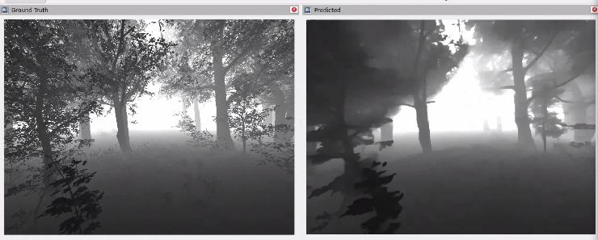

# VIO assisted DepthAnything for metric depth

This framework outputs metric depth by scaling depthmaps obtained from depth anything v2 with the help of SLAM pointcloud obtained from OpenVINS.


This work was build upon:
# DepthAnything-ROS

`DepthAnything-ROS` is a ROS2 wrapper for [Depth-Anything](https://github.com/LiheYoung/Depth-Anything).

https://github.com/scepter914/DepthAnything-ROS/assets/16330533/9fb5edd2-21b0-4441-a7c1-b304246e49b5

## Environment

- Ubuntu 22.04.01, ROS2 Humble
- CUDA 12.3, cuDNN 8.9.5.29-1+cuda12.2, TensorRT 8.6.1.6-1+cuda12.0

## Get Started

### Set Up the Environment

- 1. Install ROS2

See the [ROS2 installation documentation](https://docs.ros.org/en/humble/Installation.html) for detailed instructions.
To install ROS2 easily, I recommend using the Ansible script from [Autoware](https://github.com/autowarefoundation/autoware).
For more details, refer to [the installation guide](https://autowarefoundation.github.io/autoware-documentation/main/installation/autoware/source-installation/).

- 2. Install dependencies

```sh
sudo apt install libgflags-dev libboost-all-dev
```

- 3. Prepare your rosbag


If you don't have a rosbag, I recommend using [rosbag for Nuscenes dataset](https://github.com/scepter914/nuscenes_rosbag).

- Set ONNX Files

Place the ONNX files in the `DepthAnything-ROS/data` directory, or set the `onnx_path` parameter in the launch file.

```xml
<arg name="onnx_path" default="$(find-pkg-share depth_anything)/data/depth_anything_vitb14.onnx" />
```

To download the ONNX files for the pre-trained model, run the following commands:

```sh
# Install gdown
pip install gdown

# Download ONNX file
mkdir -p data && cd data
gdown 1jFTCJv0uJovPAww9PHCYAoek-KfeajK_
```

If you prefer to create the ONNX files yourself, you can use [depth-anything-tensorrt](https://github.com/spacewalk01/depth-anything-tensorrt).

### Launch the node

```sh
ros2 launch depth_anything depth_anything.launch.xml
```

## Interface

### Input

- `input/image` (`sensor_msgs::msg::Image`)
  - The input image.

### Output

- `~/output/depth_image` (`sensor_msgs::msg::Image`)
  - The depth image generated by DepthAnything.

### Parameters

- `onnx_path` (string)  
  - Default: `$(find-pkg-share depth_anything)/data/depth_anything_vitb14.onnx`
  - The path to the ONNX file.
- `precision` (string)  
  - Default: `"fp32"`
  - The precision mode to use for quantization. DepthAnything-ROS supports `"fp32"` or `"fp16"` ([#2](https://github.com/scepter914/DepthAnything-ROS/issues/2)).

## Notes
### Building the TensorRT Engine

The first time you run the system, you may need to wait for about 5 minutes for the build process to complete.

### Performance

- Performance data is based on results from an RTX4090 and RTX2070.

| Model                | Params  | RTX4090 TensorRT | RTX2070 TensorRT |
| :------------------- | ------- | :--------------: | :---------------: |
| Depth-Anything-Small |  24.8M  | 3 ms             | 27 ms, VRAM 300MB  |
| Depth-Anything-Base  |  97.5M  | 6 ms             | 65 ms, VRAM 700MB  |
| Depth-Anything-Large | 335.3M  | 12 ms            | 200 ms, VRAM 1750MB |

## References

- [Depth-Anything](https://github.com/LiheYoung/Depth-Anything)
- [trt-depth-anything](https://github.com/daniel89710/trt-depth-anything) – Use for TensorRT inference
- [depth-anything-tensorrt](https://github.com/spacewalk01/depth-anything-tensorrt) – Use for converting from PTH files to ONNX files
- [tensorrt_common](https://github.com/autowarefoundation/autoware.universe/tree/main/common/tensorrt_common) – Utility library
- [cuda_utils](https://github.com/autowarefoundation/autoware.universe/tree/main/common/cuda_utils) – Utility library
- [gdown](https://github.com/wkentaro/gdown) – Tool for downloading files from Google Drive

